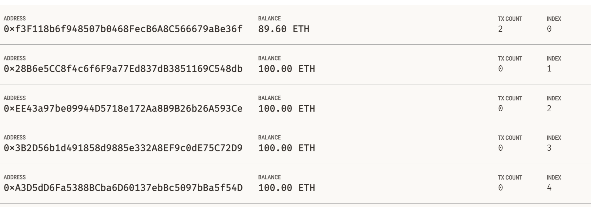
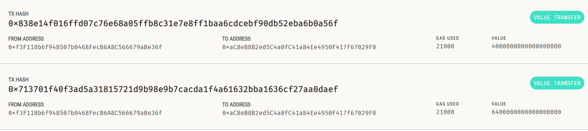
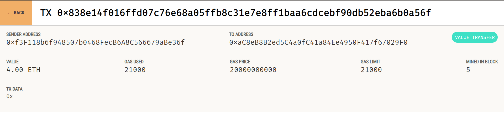

## Homework_module19
# Cryptocurrency Wallet

This homework combines Ethereum blockchain transactions with the KryptoJobs2Go application using Python files `krypto_jobs.py` and `crypto_wallet.py`.

## Instructions

### Step 1: Setup
- Import necessary functions from `crypto_wallet.py` into `krypto_jobs.py`.
- Generate an Ethereum account using mnemonic seed phrase and save it in `.env` file.
- Display Ethereum account balance.

### Step 2: Transaction
- Calculate the wage for a KryptoJobs2Go candidate.
- Send a payment transaction to the candidate.

### Step 3: Verification
- Test the application using Ganache.
- Capture and save screenshots of Ganache transaction details.

    
    
    

This homework is a demonstration of integrating Ethereum blockchain transactions into a web application using Ganache.
